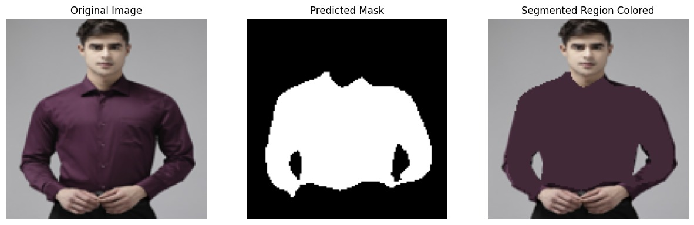
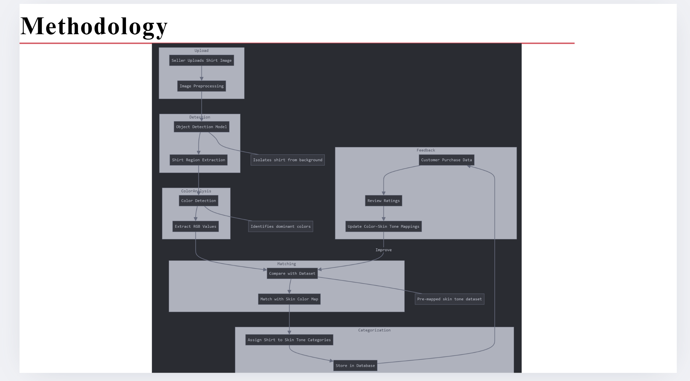
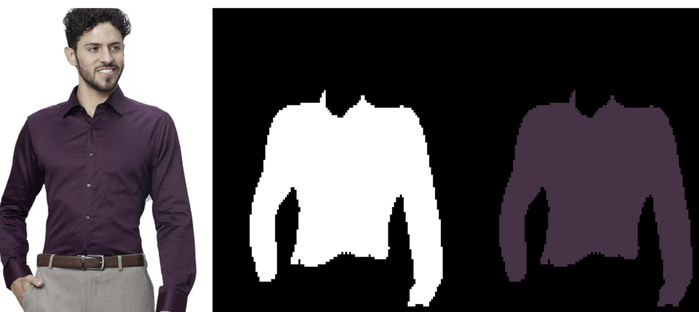
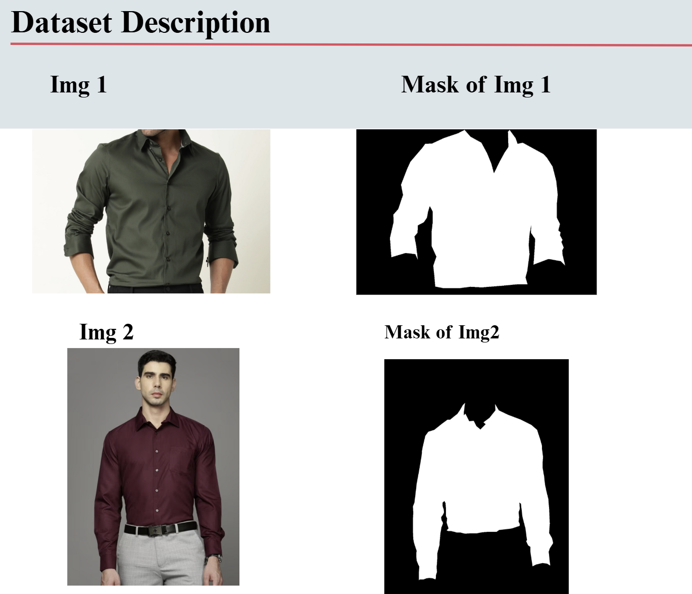

# 👕 Shirt Segmentation & Outfit Recommendation System

## 🔍 Project Summary
A complete pipeline that segments a shirt from an image, extracts its **dominant color**, and recommends suitable outfit combinations based on skin tone using a **rule-based matching system**.

---

## 📌 Project Overview
This project combines **Computer Vision**, **Deep Learning**, and **Color Theory** to:

- 🎯 Detect and segment shirts from user-uploaded images  
- 🎨 Identify the most dominant shirt color using **K-Means clustering**  
- 👤 Recommend matching outfits for various skin tones using a custom **rule engine**

---

## 🧠 Core Components

### 1. 🧥 Shirt Segmentation
Using **CNN** and **U-Net** architectures:
- Precisely isolates the shirt area from the background.
- Filters out non-shirt elements like pants, face, accessories, etc.
- Generates a clean **binary mask** to highlight shirt pixels.

### 2. 🎨 Dominant Color Extraction
Applies **K-Means clustering** on the segmented shirt region:
- Converts the image to **RGB color space**
- Groups pixels into color clusters
- Extracts the **most frequent cluster centroid** as the dominant color
- Outputs color in **RGB** (optionally HEX)

**Example Output:**
```json
{
  "RGB": {"R": 75, "G": 50, "B": 70},
  "Color Name": "Dark Purple"
}
```

### 3. 📋 Rule-Based Color Matching System
A predefined dataset maps shirt color categories to:
- Expected **RGB value ranges**
- Suggested **skin-tone matches**

```python
colors = {
    "Light Blue": (((150, 200), (200, 255), (220, 255)), "White, Brown"),
    "Blue": (((0, 50), (0, 50), (150, 255)), "White, Brown"),
    "Dark Blue": (((0, 30), (0, 30), (80, 150)), "Brown, Black"),
    ...
}
```

---

## ✅ Matching Logic
- Compare extracted RGB values with predefined color ranges  
- Identify the **closest color category**  
- Recommend matching outfits based on **skin tone compatibility**

---

## 💾 Output Example
```json
{
  "RGB": {"R": 75, "G": 50, "B": 70},
  "Color Name": "Dark Purple",
  "Matched Skin Tones": "Black, White",
  "Output File": "output_combined.jpg"
}
```



---

## 🧬 Methodology
The following diagram illustrates the entire pipeline from image upload to outfit recommendation.



---

## 🧪 Sample Visuals

### Original, Mask & Segmented Output



### Dataset Sample & Masking



---

## 🛠️ Technologies Used
- Python 🐍  
- OpenCV 🎥  
- TensorFlow / PyTorch  
- Scikit-learn  
- K-Means Clustering  
- U-Net / CNN  
- Numpy, Matplotlib

---

## 🚀 Future Improvements
- Add real-time outfit recommender with camera input  
- Build a web app using **Streamlit** or **Flask**  
- Expand dataset to support more shirt types and colors  
- Add HEX color representation and color-blind-friendly modes

---

## 🙌 Contributions
Want to improve it? Fork the repo, make changes, and create a pull request. All contributions are welcome ✨
